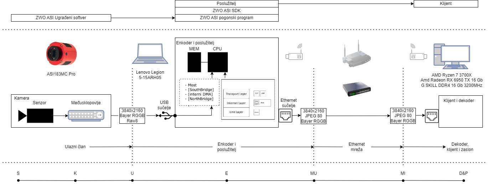
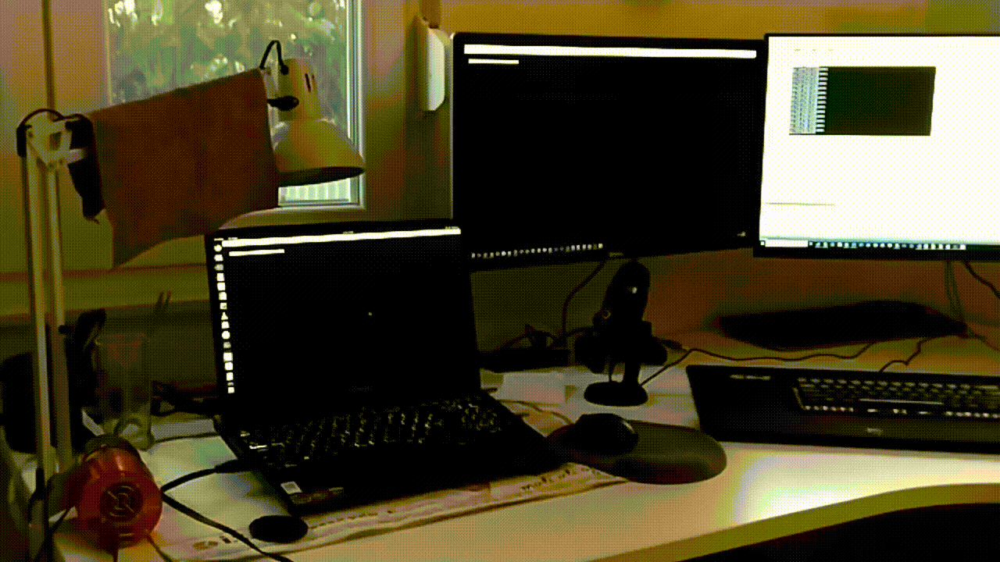
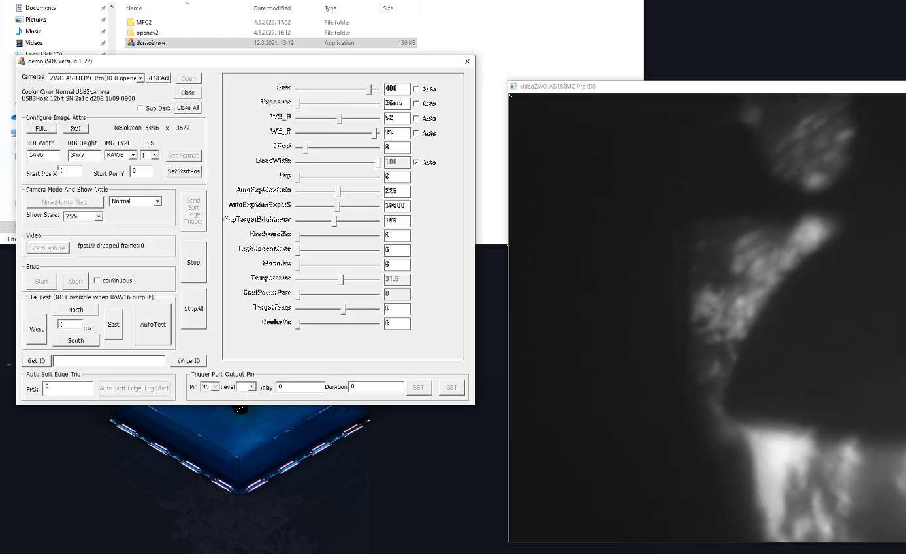

# SPS

A system for transmitting 4K video footage with low latency over short distances



## Description

Using the ASI183MC Pro camera and the accompanying SDK, two application were built: SPS 1 and 2.  

* SPS 1 uses GStreamer to form a RTSP video stream which can be accessed over the local network using a program like VLC.  

* SPS 2 on the other hand doesn't use any application level protocols. It processes and encodes images using **OpenCV**, packages the image data into raw UDP datagrams and sends them over LAN, using a manually managed socket. The provided client applications then receives the images, uses OpenCV to decode and display them.

The physical architecture diagram above shows, from top to bottom:

- The software stack, where the Server and Client apps on top are provided in this repository.

- Hardware used for testing, constiting of a ZWO USB-controlled camera, two machines running Linux or Windows, connected to the same LAN, through the medium of your choice. Results listed bellow were attained with a 1 Gbps link.

- Datapath
  
     - from the camera sensor, through the embedded image processing chip, and outputted as a serial stream (USB)
  
     - raw image bits enter the server machine CPU and RAM either through the NorthBridge or SouthBridge, depending on your architecture
  
     - encoded images pass through the OSI stack, and travel over LAN to the client machine
  
     - in the same way, the client machine receives the encoded data, decodes and displays it.

## Results

The `masters_thesis.pdf` document (croatian language) included with the repo describes in detail how the specific protocols and their parameters were chosen and tuned to the hardware used in testing. By limiting the data generation, modifying compression and encoding settings, and optimizing the decode&display hot loop, and a partial offload to the GPU thanks to OpenCV primitives, local resources were used to their fullest extent. The table bellow shows what was achieved with a resolution of 2560x1440.



|                      | Transmit FPS | Receive FPS | Decoding FPS | Latency [ms] | STDDEV [ms] |
| --------------------:|:------------ | ----------- | ------------ | ------------ | ----------- |
| SPS1                 | 30,00        | 30,00       | 1891,66      | -            | -           |
|                      | 20,00        | 20,00       | 170,83       | -            | -           |
|                      | 10,00        | 10,00       | 166,66       | -            | -           |
| SPS2 No JPEG         | 31,38        | 12,85       | 12,83        | 37,06        | 4,01        |
| SPS2                 | 20,49        | 20,21       | 19,53        | 63,19        | 14,58       |
|                      | 54,93        | 54,49       | 23,58        | 61,57        | 9,36        |
|                      | 114,23       | 113,01      | 20,60        | <u>55,83</u> | 11,00       |
| SPS2 with debayering | 25,32        | 23,77       | 10,00        | 159,16       | 26,00       |
|                      | 54,32        | 50,12       | 10,12        | 191,58       | 32,91       |
|                      | 110,10       | 100,92      | 8,72         | 154,58       | 32,91       |

Increasing the capacity of the encoding and decoding GPUs, as well as the network capacity could improve results even further. Additional ideas are discussed in the Conclusion chapter of the thesis.

## Options for running

Assuming you have a ZWO USB camera available, you have 3 main options to use it with you computer, in order of difficulty:

1. User ready-made ZWO software like ASI Studio - [steps](#installing-asistudio)

2. Download the SDK and just run one of the prebuilt .exe examples in it - [steps](#running-demoexe)

3. Install dependencies and ZWO libraries from the SDK, allowing you to modify their examples and build SPS - [steps](#setting-up-the-environment)

Steps are covered chronologically, so if you are not sure, just start here and follow the instructions:

# Setting up the environment for building

Ready-made software for controlling the camera called ASIStudio, as well as the developer SDK are packaged together, and can be found [here](https://astronomy-imaging-camera.com/software-drivers)

ZWO provides SDKs for both Linux and Windows. Both were tested and used, so choose which ever one you prefer.

## Linux:

### Installing the SDK and running the default examples

Install dependencies:

```
sudo apt-get install -y build-essential pkg-config libssl-dev git net-tools libncurses-dev
sudo apt install libopencv-dev python3-opencv
```

Note: if you want platform=x86, install necessary m32 libs with:

```
sudo apt-get install gcc-multilib
```

Making the SDK libraries available accessible to the linker

1) download the [ASI Camera SDK](https://www.zwoastro.com/downloads/developers)  

2) unzip with `tar '-xvjf ASI_linux_mac_SDK_V1.28.tar.bz2'`

3) `cd ASI_linux_mac_SDK_V1.28`

4) `cd /etc/ld.so.conf.d/`

5) `sudo touch libASICamera2.conf`

6) `sudo gedit libASICamera2.conf`, then add the path to the ~/ASI_linux_mac_SDK_V1.28/lib/x64 folder
   
      1) e.g., if you unpacked the SDK to /home/user/zwo, then add `"/home/user/zwo/ASI_linux_mac_SDK_V1.22/lib/x64"`, then save and exit

7) `sudo ldconfig`

Building and running the demo software

1) `cd ~/ASI_linux_mac_SDK_V1.22/demo/bin`

2) `mkdir x64`

3) replace 1 line in main_SDK2_snap.cpp and main_SDK2_snap.cpp_video.cpp:
   from: "cvSet(pRgb, CV_RGB(180, 180, 180));"
   to:      "cvSet(pRgb, cvScalar(180, 180, 180));"

4) `cd /demo`

5) `make platform=x64`
   3 applications are created in /demo/bin/x64

6) `cd /demo/bin/x64`

7) `chmod +x main_SDK2_video_mac test_gui2_snap test_gui2_video`

8) connect the camera

9) `sudo ./test_gui2_video`
   from there follow the onscreen instructions to select and configure the camera.

Troubleshooting:

- depending on the version of OpenCV that you install, the makefile may need to be edited for the header to be visible. For instance, if you install opencv4, you will need to modify the OPENCV variable:
  from: `OPENCV = -lopencv_core -lopencv_highgui -lopencv_imgproc#$(shell pkg-config --cflags opencv) $(shell pkg-config --libs opencv) -I/usr/include/opencv4/opencv/`
  to:      `OPENCV = -lopencv_core -lopencv_highgui -lopencv_imgproc $(shell pkg-config --cflags opencv4) $(shell pkg-config --libs opencv4) -I/usr/include/opencv4/opencv2/`
- If you see errors indicating "USB lib is missing", make sure the `~/ASI_linux_mac_SDK_V1.28/lib/x64/libASICamera2.so` is named just like so. There shouldn't be anything appended to the end, like ".1.27"
- If you're getting errors for the ASI DLLs, make sure you did the steps 4-7 in the correct path
- Sometimes the build files get corrupted, but that can be fixed by running ```make clean``` in /demo

## Windows:

### Running prebuilt demo.exe

1) Download and install the [ASI Cameras ZWO Windows driver](https://www.zwoastro.com/downloads/windows) ([direct download](https://dl.zwoastro.com/software?app=AsiCameraDriver&region=Overseas))

2) Download and unzip the [ASI Camera SDK](https://www.zwoastro.com/downloads/developers)

3) add these paths to system PATH
   
   - SDK\lib\x86                              #(ASICamera2.dll)
   
   - SDK\demo\opencv2\lib         #(opencv_imgproc247.lib)
   
   - SDK\demo\opencv2\bin        #(opencv_imgproc247.dll)
     or, alternatively, place the DDLs in the directory where you want to run the demos

4) run demo.exe

### Build demo2.exe

1. download and install [Visual Studio 19 Community](https://visualstudio.microsoft.com/vs/older-downloads/) and add the C++ Development components
   
      1. MSVC v142 - VS 2019 C++ x64/86 build tools (latest)
   
      2. C++ MFC for latest v142 build tools (x86 & x64)
   
      3. C++ ATL for latest v142 build tools (x86 & x64)

2. Download and unzip the [ASI Camera SDK](https://www.zwoastro.com/downloads/developers)

3. Open demo2.sln
   
      1. note: if a prompt says some files exist from demo.sln and asks to replace them click "No"

4. Project Properties > Linker > Input > Additional Dependencies > Edit (little arrow on the right), modify first line to: `../../lib/x86/ASICamera2.lib`

5. Build the project (Right click on the project in the Solution Explorer on the right of the screen, or use the `Local Windows Debugger` button on the top)

6. `demo2.exe` is created in `/Debug`, connect the camera and run it
   
      1. note: `demo2.exe` in ../ is a prebuilt app, so it has nothing to do with new builds

Notes:

- if you accidentally add "SDK\lib\x64" to the path and run demo.exe, you will get: "The application was unable to start correctly (0xc000007b)"
- the demo source code appears to be written for VS2010 SP1, so a migration to 2019 is required and expected
- the original ReadMe.txt notes file has an encoding problem so the characters don't display properly. To fix, open the file in Notepad++ or rename it to ReadMe.html and open using a browser

# SPS 1 and 2

Once you have the SDK configured in your environment of choice, we can move on to building and running the SPS apps.
All the examples require additional codecs, Gstreamer libraries, Boost and the Tbb library, so we'll demonstrate installing those

## Linux

1) install additional codecs, Gstreamer libraries, Boost and the Tbb library using apt-get
   
   ```
   sudo apt-get install libavcodec-dev libavformat-dev libswscale-dev h264enc libx264-dev
   sudo apt-get install libavcodec-extra-52 libavdevice-extra-52 libavfilter-extra-0 libavformat-extra-52 libavutil-extra-49 libpostproc-extra-51 libswscale-extra-0
   sudo apt-get install libgstreamer1.0-dev libgstrtspserver-1.0-dev gstreamer1.0-libav gstreamer1.0-plugins-ugly libgstreamer-plugins-base1.0-dev gstreamer1.0-rtsp
   sudo apt-get install libboost-all-dev
   sudo apt install libtbb-dev
   ```

2) replace the default ZWO SDK Makefile with the one provided in this repo. It adds the headers and libraries for Boost, Gst and Tbb to the build.

## Windows, using VS19

1) Install vcpkg by following the [official instructions](https://vcpkg.io/en/getting-started.html)

2) Install the required libraries using:
   
   ```
   vcpkg install boost    #note: install time is around 30 minutes
   vcpkg install opencv   #note: install time is around 10 minutes
   vcpkg install tbb
   vcpkg install ffmpeg[core,avcodec,avdevice,avfilter,avformat,ffmpeg,ffplay,ffprobe,amf,opencl,x264,x265,swscale,nonfree]     #note: install time is around 15 minutes
   ```

3) Run VS19 and create a new blank project

4) vcpkg installs x86 dependancies, so we need to choose x86 as the target in VS19. This can be done using a drop-down menu at the top, next to the `Local Windows Debugger` button

5) Copy and paste the code of the desired SPS version into the new project

6) Build the project

# Running

SPS1 is based on GStreamer, so an example of server and client commands might look something like this:

Build

`g++ -o test-launch testB11.cpp 'pkg-config --cflags --libs opencv4 gstreamer-1.0 gstreamer-app-1.0 gstreamer-rtsp-server-1.0'`

Machine 1 - stream

`GST_DEBUG=3 ./test-launch`

Machine 2 - watch:

`gst-launch-1.0 -v playbin uri=rtsp://192.168.1.108:8554/test uridecodebin0::source::latency=0`

- note: make sure to update the IP hardcoded in app and commands to your current local IPv4, which can be found by typing `ip address` or `ipconfig`

- you can also use any video player capable of opening a network stream, like VLC

For SPS2, Instructions for running the client and server applications on the individual machines can be found in readme files next to the code.

For ease of use, default settings have been hardcoded into appropriate server and client files, but if you wish to tinker with them, either edit the 

# Installing ASIStudio



For testing the camera and easily fine-tuning its settings, you can use the ASI Studio desktop application, or the ZWO Android up.

Linux setup and usage are as follows:

1. download [ASIStudio.run](https://www.zwoastro.com/downloads/linux)

2. `chmod +x ASIStudio.run`

3. `./ASIStudio.run` - the installer automatically handles everything

Using ASIStudio:

* note: when recording, careful of disk space: 10s of 5K .avi produces ~11Gb of data!
* in settings, tick boxes are a bit broken:
     * when they're unselected you see them normally. However, if you select them, a tick doesn't appear, instead the box becomes invisible (but its still there).
     * So, if you want to turn of lets say "Save as tiff", just click left of the label
     * note: TIFF is only available in RAW16, while RAW8 can only be PNG
* "RAW data" changes the format from "No Debay PNG" to "Color PNG"
     * you can see the format in the bottom right of the menu
     * This setting also overrides the Debayering button in the video pane
* in the '...' menu, under control, you can set the USB traffic speed (auto is default), "High Speed" mode, Hardware binning and more
* eaf == Electronic Automatic Focuser, efw == Electronic Filters Wheels

# Android App

Used equipment:

- ASI183MC Pro camera

- ASIAIR PRO controller

- SD containing the configuration and a USB stick for saving the images from the ASIARI PRO controller

- USB 3.0 Type-A male to Type-B male

- 12V DC 2.0A power supply (Tuning Fork DC Plug 5.5*2.5mm DC Molding Cable)

Setup

1) download and install ASIARI Android app (from WZO)

2) Plug in a SD into the camera and the USB into one of the 2.0 port on ASIAIR pro

3) Connect the camera to the ASIARI using the USB 3.0 port and connect the power supply

4) Turn on ASIARI and wait around 10 seconds (it will make a beep when it's ready)

5) Connect to ASIAIR's Wi-Fi using your phone
   
   - the SSID and password can be found on the back of the device; e.g. `"SSID: ASIAIR_e45a4326, PASS:12345678"`

6) Turn on the ASIAIR app, select the desired camera and start

7) Change the mode to Video to see a live preview
   
   - AVI is raw (saved on SD card), MP4 isn't (saved on the phone)

Using the app:

- top right (Preview): change mode
- top: settings shortcuts
- BinX settings: 2x the bin means /2 the resolution but 2* the brightness
